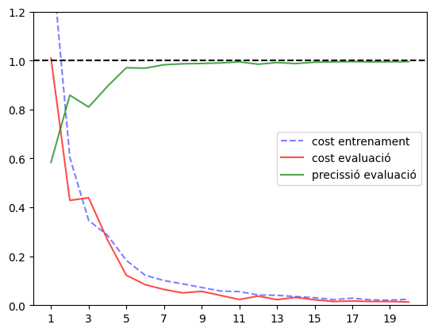
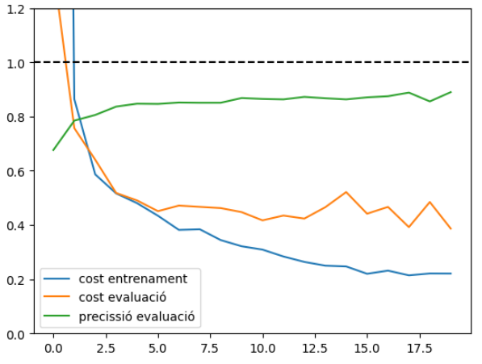

# Gravitational-Waves-Glitch-Detection
Classification of glitches in Gravitational Waves data from:

-  [Images of simulated glitches in Numpy format](https://doi.org/10.6084/m9.figshare.7166210.v1). Razzano, Massimiliano (2018)

- [Machine learning for Gravity Spy: Glitch classification and dataset](https://doi.org/10.5281/zenodo.1476156). Bahaadini, Sara1; Noroozi, Vahid; Rohani, Neda1; Coughlin, Scott; Zevin, Michael; Smith, Joshua; Kalogera, Vicky; Aggelos, Katsaggelos (October 31, 2018)

## Set up
Install dependencies
```
pip install --upgrade build
python -m build
```

To get the synthetic glitches dataset in the project structure, run:
```
python3 ./src/ml/data/download_SG_data.py
```
To get the Gravity Spy dataset:
```
python3 ./src/ml/data/download_GS_data.py
```

## Models

Training over simulated glitches dataset:



Training over Gravity Spy dataset:


